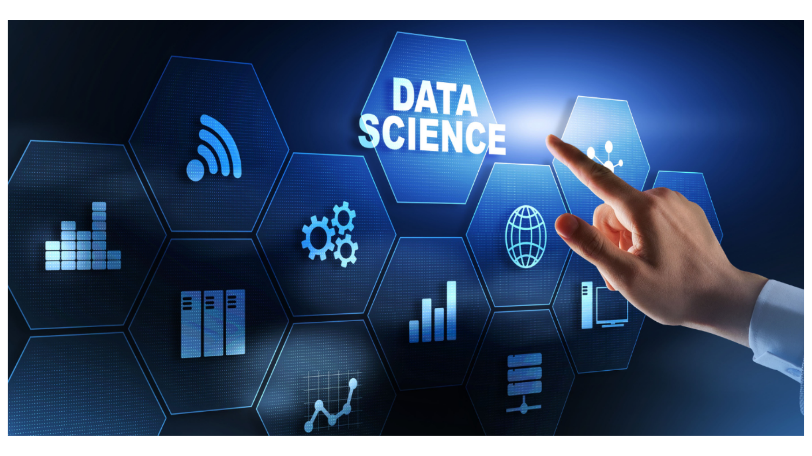

# Data Scientist | Machine Learning Enthusiast | Problem Solver 🧠

👋 Hi there, I'm Mohamed Elhassnaoui,
a passionate Data Scientist with a keen interest in machine learning, deep learning, and computer vision challenges.

🔭 I'm constantly exploring the realms of data to uncover valuable insights and solve real-world problems using the power of algorithms and analytics.

🌱 Currently, I'm on a learning journey that encompasses the exciting worlds of development, machine learning, and deep learning. Each day brings new opportunities to expand my skill set and create innovative solutions.

💼 I'm always open to exciting collaborations and projects that involve cutting-edge technologies and meaningful data-driven initiatives. If you're looking to collaborate, feel free to reach out!

📫 You can connect with me on [LinkedIn](https://www.linkedin.com/in/mohamed-elhassnaoui-7a2162211/), where I share my thoughts and insights on data science and technology.

Keep exploring, learning, and creating

<!---
Elhassnaoui2001/Elhassnaoui2001 is a ✨ special ✨ repository because its `README.md` (this file) appears on your GitHub profile.
You can click the Preview link to take a look at your changes.
--->
<!-- My CV -->
## 📄 CV
You can download my CV to learn more about my qualifications and experience:
[Download CV](https://github.com/Elhassnaoui2001/Cv_Mohamed_Elhassnaoui.pdf)

